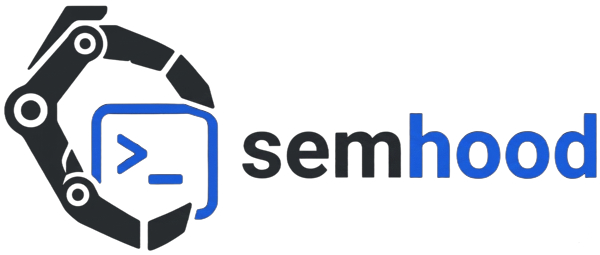

<!-- mcp-name: io.github.AhmeedGamil/semhood -->

<div align="center">

<picture>
  <source media="(prefers-color-scheme: dark)" srcset="assets/semhood_dark.png">
  <source media="(prefers-color-scheme: light)" srcset="assets/semhood_light.png">
  
</picture>

# semhood

**Stop grepping.** Find the exact code your AI agent needs by intent, not keywords. semhood is an AST-aware semantic code search engine that retrieves code by what it does, complete with call-graph context and optional LLM enrichment.

*Runs fully offline with zero API keys — or plug in cloud embeddings — Voyage's code-specialized models, or OpenAI's strong general-purpose (natural-language) embeddings — for higher-quality retrieval. Optional LLM enrichment adds a logic summary and developer queries to each chunk that you commit once and share — and every result ships with its call graph (what it calls + what calls it).*

[](LICENSE)
[](https://github.com/ahmeedgamil/semhood/actions)
[](https://modelcontextprotocol.io/)
[](https://tree-sitter.github.io/)

[**Why semhood**](#what-makes-semhood-different) ·
[**Install**](#-install) ·
[**Quickstart**](#-60-second-quickstart) ·
[**MCP Setup**](#-mcp--wire-it-into-your-ai-editor) ·
[**Architecture**](#%EF%B8%8F-architecture) ·
[**Config**](#%EF%B8%8F-configuration) ·
[**Troubleshooting**](#-troubleshooting)

<!-- DEMO (highest-impact addition): record a ~15s clip showing
       `semhood index .`  →  `semhood search "..."`  →  a result with its call graph.
     Capture with vhs (github.com/charmbracelet/vhs), terminalizer, or asciinema+svg-term.
     Save it as assets/demo.gif, then uncomment the line below: -->
<!--  -->

</div>

---

```text
   ┌──────────────┐    parse + embed     ┌──────────────┐    LLM enrich    ┌──────────────┐
   │  source tree │ ───────────────────► │ code  vector │ ──────────────► │  description │
   │              │                      │ + BM25 sparse│                  │  + queries   │
   └──────────────┘                      └──────────────┘                  └──────────────┘

                                Search via CLI, HTTP, or MCP.
```

semhood indexes your codebase the way a developer thinks about it: every function, method, and class becomes a chunk, with its call graph, docstring, and signature attached. You search by intent (*"how do we retry transient payment failures?"*) and get back the few chunks that actually answer the question.

Two stages: **structural** (always, free, ~seconds) and **enrichment** (optional, LLM or code agent, drains a `pending` queue). The index is queryable after stage 1; stage 2 just makes natural-language matches sharper.

The package ships an **MCP server** so Claude Desktop, Cursor, Cline, Continue, Kiro, Zed, and any other MCP-aware client can call semhood as a tool — your AI agent gets `search`, `find_symbol`, and `get_chunk_context` next to its built-in `read_file` and `grep`.

---

## What makes semhood different

Most code search embeds your raw source and hopes a natural-language query lands near it. semhood adds two things plain vector search and grep can't:

### 🧠 Enrichment that thinks like a developer

An LLM reads each function and class and writes two artifacts, each stored as its own search vector:

- **A logic summary** — what the code actually *does*, in plain language. Not its name, not its signature — its behavior.
- **Predicted developer questions** — the real questions an engineer would ask to find this code: *"how do we retry a failed payment?"*, *"where are customer emails validated?"*

This is the part that makes retrieval click. When you search with a question, you're matching against **questions the code was pre-labeled to answer** — so the right chunk wins even when it shares *zero keywords* with your query. You generate the enrichment **once**, commit it to git, and your whole team — and every AI agent — retrieves better for free. → [Portable enrichment](#portable-enrichment--pay-once-share-survive-model-changes)

**Why enrichment matters: some code has no words to search.** Plain semantic search only works when the source *contains* language close to your question. Plenty of important code doesn't — terse names, raw math, business rules. Consider a function like:

```python
def _calc(p, r, n):
    return p * (1 + r) ** n
```

Ask *"how do we calculate compound interest?"* and plain vector search comes up empty — there's no "interest", no "compound", nothing in the source that means anything close to the question. Enrichment reads the code and generates:

```jsonc
{
  "logic_summary": "Computes compound interest — final balance = principal × (1 + rate)^periods.",
  "developer_queries": [
    "how do we calculate compound interest?",
    "where is the future-value / compounding formula?",
    "how is a balance grown over multiple periods?"
  ]
}
```

Now your question matches a **pre-written question that means the same thing**, and `_calc` ranks first — despite sharing *zero words* with your query. The cryptic-but-critical functions are exactly the ones plain semantic search misses and enrichment rescues.

### 🕸️ Every result ships with its call graph

Each chunk knows **what it calls** and **what calls it**. So a result isn't just "here's the function" — it's the function *plus its neighborhood*. One `get_chunk_context` call returns the body, `calls`, and `called_by` together, so your AI agent gets the caller/callee context in the same response instead of opening files and tracing references by hand.

---

## Features

- **Retrieval-boosting enrichment** — an LLM gives each chunk a plain-language **logic summary** + **predicted developer questions**, indexed as their own vectors so question-style queries hit the right code even with zero shared keywords. Written once, committed to git, shared with the team.
- **Call graph included** — each result knows what it **calls** and what **calls it**, so your agent gets the neighborhood, not just the function
- **AST-aware chunking** via Tree-sitter — every function, method, and class becomes a first-class searchable unit
- **Hybrid retrieval** — dense vectors (`code`, `description`, `developer_queries`) + BM25 sparse, all in one query
- **Token-efficient for AI agents** — replaces dozens of `read_file` + `grep` calls with one `search`
- **MCP server out of the box** — works with Claude Desktop, Cursor, Cline, Continue, Kiro, Zed
- **10 languages** — Python, JavaScript, TypeScript, Java, Go, PHP, C#, Ruby, Rust, C++
- **Free tier works** — local embeddings + structural pipeline need zero API keys
- **Incremental indexing** — `--changed` re-indexes only what `git diff` touched

---

## Install

```bash
# Local-only (free, offline embeddings via sentence-transformers)
pip install "semhood[local]"

# With everything: voyage + openai + anthropic + cohere + chroma
pip install "semhood[all]"

# Pick exactly what you need
pip install "semhood[anthropic,local]"
```

**Prefer an isolated CLI install?** [pipx](https://pipx.pypa.io) keeps semhood and its deps out of your global environment — recommended for a command-line tool:

```bash
pipx install "semhood[local]"
```

**Just want to try it without installing?** With [uv](https://docs.astral.sh/uv/), run it straight from PyPI:

```bash
uvx --from "semhood[local]" semhood index .
```

> **Requires** Python 3.11+. First index downloads the embedding model (~420 MB for the default `all-mpnet-base-v2`) and caches it.

---

## 60-second quickstart

No config files, no API keys, no setup. semhood works offline with a local
embedder by default. Just `cd` into any project and index it:

```bash
# 1. structural index — no LLM, free, no config needed
cd ~/code/your-project
semhood index .

# 2. search — pure retrieval, ~80 ms (a background daemon stays warm)
semhood search "how does the payment retry logic work?"

# 3. (optional) LLM enrichment — needs an Anthropic/OpenAI/OpenRouter/Ollama key
semhood enrich

# 4. (optional) full RAG with answer generation
semhood query "where is auth handled?"
```

The first command auto-starts a background **daemon** that loads the embedding
model once and keeps it warm — so every later search (from any terminal or
your editor) is instant. Each project gets its own index automatically under
`~/.semhood/indexes/`, keyed by repo root. One global config lives at
`~/.semhood/config.yaml` (created on first run); there is **no per-project
config file** to manage.

---

## CLI commands

| Command | What it does |
|---|---|
| `semhood index <path>` | Stage 1: parse + embed + upsert. No LLM. |
| `semhood index <path> --changed` | Incremental — only files in `git diff HEAD~1`. |
| `semhood index <path> --reset` | Rebuild from scratch (after changing the embedding model). |
| `semhood enrich` | Stage 2: drain pending chunks through an LLM. |
| `semhood enrich --force` | Re-enrich every chunk. |
| `semhood compact` | Prune orphaned records from `.semhood/enrichment.jsonl`. |
| `semhood search "query"` | Pure retrieval. `--format json/paths/compact/table`. |
| `semhood query "question"` | Full RAG: retrieval + answer generation. |
| `semhood status` | Per-state chunk counts + provider summary. |
| `semhood projects` | List every indexed project in `~/.semhood/indexes/`. |
| `semhood serve` | Run the daemon in the foreground (it otherwise auto-starts). |
| `semhood stop` | Stop the background daemon. |
| `semhood doctor` | Daemon + config health check. |

> All commands act on the **current project** (nearest git root of your cwd).
> Override with `--root /path/to/repo`. They're thin clients to the daemon — no
> model loading, no `config.yaml` flag.

---

## MCP — wire it into your AI editor

The package ships an MCP server (`semhood-mcp`) that exposes eight tools — five for search, three for agent-driven enrichment:

| Tool | Use it for |
|---|---|
| `search` | Semantic search over the index. |
| `search_many` | Several searches in one call — results grouped per query. |
| `find_symbol` | Exact-name lookup for a function/method/class. |
| `get_chunk_context` | Full source + calls + called_by for a symbol. |
| `index_status` | Sanity-check the index. |
| `list_pending_enrichments` | Get a batch of chunks needing LLM enrichment. |
| `save_enrichment` | Persist a summary the agent wrote. |
| `enrichment_progress` | Loop sentinel — pending vs done. |

**Register it once, globally** — it then works in every project you open, with
no per-project setup. This is the entire config — drop it into your editor's
*user-level* MCP file:

```json
{
  "mcpServers": {
    "semhood": {
      "command": "semhood-mcp"
    }
  }
}
```

<details>
<summary><b>Where that file lives, per editor</b> (click to expand)</summary>

| Editor | Config file |
|---|---|
| **Claude Desktop** (macOS) | `~/Library/Application Support/Claude/claude_desktop_config.json` |
| **Claude Desktop** (Windows) | `%APPDATA%\Claude\claude_desktop_config.json` |
| **Cursor** | `~/.cursor/mcp.json` (global) or `.cursor/mcp.json` (per-project) |
| **Windsurf** | `~/.codeium/windsurf/mcp_config.json` |
| **Cline** (VS Code) | Cline panel → **MCP Servers** → *Configure* (edits `cline_mcp_settings.json`) |
| **Continue** | `~/.continue/config.yaml` → under a `mcpServers:` block |
| **Kiro** | `~/.kiro/settings/mcp.json` |
| **Claude Code** | `claude mcp add semhood semhood-mcp` |

> A few clients use a slightly different shape — e.g. VS Code's native MCP uses a
> top-level `"servers"` key instead of `"mcpServers"`. If yours differs, keep the
> `command: "semhood-mcp"` part and match the client's MCP docs for the wrapper.

</details>

That's the whole config — no `config.yaml` path, no per-project entry. The
server is a thin proxy: it forwards each call to the warm daemon, tagged with
the project the editor currently has open (its nearest git root). Most editors
launch the server with the workspace as the working directory, so this Just
Works; if yours doesn't, pass the root explicitly:

```json
{ "command": "semhood-mcp", "args": ["--root", "${workspaceFolder}"] }
```

After restarting the editor, the agent sees `semhood.search`,
`semhood.find_symbol`, etc. The daemon loads the model once for the whole
machine — so no matter how many editors and terminals you have open, there's
one model in memory and every call is ~80 ms.

### Teach the agent *when* to use it (optional)

The MCP server gives the agent the tools; a short **skill** teaches it to reach
for semantic search before grep/read. Install it once, user-level, into every
AI editor you use:

```bash
semhood install-skill            # auto-detects installed editors
semhood install-skill -t all     # or force every supported target
```

Supported: Claude Code (skill), Cursor & Windsurf (rules), Kiro (steering),
Codex (`AGENTS.md`). It writes to each editor's own convention at the user
level — so, like everything else here, it's set up once and applies to every
project. Re-run any time to update in place.

### Why this matters for token usage

Without semantic search, an AI agent asked *"where do we validate emails?"* runs `grep -r email`, gets 200 hits, and reads dozens of files. With semhood it calls `search("validate email")`, gets 3 ranked chunks back as JSON (~500 tokens), and reads only what it needs.

### Worked example — *"How does the OrderService validate orders?"*

I indexed `sample_project/`, then asked exactly that. The agent calls **two** MCP tools and is done — no `read_file`, no grep.

<details>
<summary><b>Step 1 — <code>search</code> narrows the question to a few candidates</b></summary>

```json
{
  "query": "how does OrderService validate an order before processing",
  "embedding_dim": 768,
  "results": [
    {
      "score": 0.455,
      "qualified_name": "OrderService::_validate",
      "file": "orders.py", "line_start": 115, "line_end": 124,
      "type": "method", "enrichment_state": "pending"
    },
    {
      "score": 0.397,
      "qualified_name": "OrderService",
      "file": "orders.py", "line_start": 49, "line_end": 124,
      "type": "class",
      "summary": "High-level orchestrator for placing and processing orders. Coordinates payment authorization (PaymentProcessor) and customer notification (NotificationService)."
    },
    {
      "score": 0.363,
      "qualified_name": "OrderService::place_order",
      "file": "orders.py", "line_start": 67, "line_end": 93,
      "summary": "Validate, charge, and confirm an order in one shot."
    }
  ]
}
```

The `_validate` method ranks #1. The class and `place_order` rank just below — useful context, not the answer.

</details>

<details>
<summary><b>Step 2 — <code>get_chunk_context</code> pulls the body, calls, and called_by without opening the file</b></summary>

```json
{
  "found": true,
  "chunk": {
    "qualified_name": "OrderService::_validate",
    "file": "orders.py", "line_start": 115, "line_end": 124,
    "source": "def _validate(self, order: Order) -> None:\n    if order.is_empty():\n        raise ValueError(\"Order has no line items\")\n    if order.total_cents() < self.MIN_ORDER_CENTS:\n        raise ValueError(...)\n    if \"@\" not in order.customer_email:\n        raise ValueError(\"customer_email must be a valid email address\")",
    "calls": ["order.is_empty", "ValueError", "order.total_cents"],
    "called_by": [
      {"function": "place_order", "class_name": "OrderService", "file": "orders.py", "line": 67}
    ]
  }
}
```

That's the entire answer: three checks (non-empty, minimum total, email contains `@`), called once from `place_order`. Total cost: ~1.4 KB of JSON, two MCP calls, sub-second.

</details>

Compared to the grep-then-read alternative — open `orders.py` (3.5 KB), scan for `validate`, then trace into `place_order` to confirm the call — the MCP path uses roughly **40% of the tokens** and skips file I/O entirely.

---

## Two ways to enrich

Stage 2 (description / developer_queries vectors) needs an LLM. You pick how:

### Option A — direct API
semhood calls Claude / GPT / OpenRouter / Ollama itself.

```bash
semhood enrich
```

Best for CI, batch jobs, or users without an AI editor. Set `llm.provider` + `llm.<provider>.api_key` in `config.yaml`.

### Option B — your AI agent does it
Skip the API key. The agent in your editor (Claude in Cursor, Kiro, Cline, Continue, etc.) loops over pending chunks via the MCP tools and writes summaries itself. **No semhood-side LLM cost.** Just say:

> *"enrich the codebase index"*

The agent uses `list_pending_enrichments` → writes summary → `save_enrichment` → repeats until `enrichment_progress` reports zero pending. Uses the model + subscription you already pay for.

---

## Portable enrichment — pay once, share, survive model changes

Enrichment (the LLM-written summaries + developer queries) is the only part of semhood that costs tokens. semhood persists that text to **`.semhood/enrichment.jsonl`** in your repo, keyed by each chunk's content hash — separate from the vector index (which lives in `~/.semhood/indexes/` and is disposable).

**Commit `.semhood/enrichment.jsonl` to git.** Doing so gives you:

- **Share across a team** — a teammate clones, runs `semhood index`, and the enrichment is restored from the file and re-embedded locally. They pay **zero** LLM tokens for code that's already enriched.
- **Survive embedding-model changes** — switch from a local model to Voyage/OpenAI, run `semhood index --reset`, and your enrichment is re-embedded into the new vector space with **no re-enrichment**. (Without this, changing models meant re-paying for everything.)
- **Survive branch switches / reverts** — old records are kept as a content-addressed cache, so checking out an older revision reuses its enrichment instantly.

It's content-addressed, so it's always safe: if a chunk's code changed, its hash misses and that chunk is simply re-enriched — stale summaries can never attach to changed code. Run `semhood compact` to prune records no longer referenced by any code. The file holds only text and contains no secrets.

```
.semhood/enrichment.jsonl   ← commit this (portable enrichment, ~text)
~/.semhood/indexes/<id>/    ← never committed (vectors, machine-local)
```

---

## OpenRouter — one key, every model

If you don't want to manage Anthropic + OpenAI + Google accounts separately, point semhood at [OpenRouter](https://openrouter.ai):

```yaml
llm:
  provider: "openrouter"
  openrouter:
    api_key: "${OPENROUTER_API_KEY}"
    model: "anthropic/claude-sonnet-4.6"   # or openai/gpt-5.5, anthropic/claude-opus-4.7, etc.
```

Use any [supported model slug](https://openrouter.ai/models). Same `semhood enrich` and `semhood query` commands as before.

---

## Architecture

Three named dense vectors per chunk: `code` (always), `description` (post-enrichment), `developer_queries` (post-enrichment), plus a `bm25` sparse vector. Pre-enrichment, search still works on `code` + BM25 alone.

**Stage 1** (`semhood index`) parses files with Tree-sitter, builds the call graph, computes a source hash, embeds the raw source into the `code` vector, and upserts to Qdrant. No LLM calls. Every chunk lands in state `pending`.

**Stage 2** (`semhood enrich`) drains the pending queue through an LLM, generating a logic_summary + 5–10 developer_queries per chunk, embedding them into the `description` and `developer_queries` vectors and mirroring the text to the portable `.semhood/enrichment.jsonl` store. State flips to `fresh`. Trivial chunks get a free template; tests get pattern-skipped.

---

## Configuration

semhood uses **one global config** at `~/.semhood/config.yaml` (created with
working defaults on first run) — the daemon loads it for every project. You can
still point at an explicit file with `$SEMHOOD_CONFIG`. Environment-variable
refs (`${VAR}`) resolve from `~/.semhood/.env`, a local `.env.semhood`/`.env`,
or the real environment. Indexes are stored centrally under
`~/.semhood/indexes/<id>/`, one per project root — you don't set a `path`.

```yaml
embeddings:
  provider: "local"            # local | voyage | openai | cohere
  local:
    model: "sentence-transformers/all-mpnet-base-v2"
  # voyage:                    # code-tuned, no local load — needs an API key
  #   api_key: "${VOYAGE_API_KEY}"
  #   model: "voyage-code-2"

llm:
  provider: "anthropic"
  anthropic:
    api_key: "${ANTHROPIC_API_KEY}"
    model: "claude-sonnet-4-6"

vector_db:
  provider: "qdrant"        # path is managed per-project by the daemon

enrichment:
  enabled: true
  version: 1
  llm_concurrency: 4
  skip_patterns: ["**/test_*.py", "**/*_test.go", "**/tests/**"]
  skip_trivial:
    enabled: true
    max_lines: 3
```

### Supported languages

<div align="center">


</div>

---

## Troubleshooting

| Symptom | Cause | Fix |
|---|---|---|
| `qdrant... already accessed by another instance` | Something opened an index directly while the daemon holds it | The daemon is the sole index owner by design — use the CLI/MCP, don't open `~/.semhood/indexes/*` yourself. Restart with `semhood stop`. |
| Search returns nothing on `description` / `developer_queries` | Stage 2 hasn't run | Run `semhood enrich`, or use the MCP `list_pending_enrichments` flow. |
| Dimension mismatch on query | Embedding model changed since last index | Delete that project's dir under `~/.semhood/indexes/` and re-`semhood index .` |
| First command takes ~15 s | Daemon is loading the model (one time, machine-wide) | Normal on first use; every call after is ~80 ms. Run `semhood doctor` to confirm it's warm. |
| Daemon won't start / commands hang | Bad config or port in use | Check `~/.semhood/daemon.log`; set `SEMHOOD_DAEMON_PORT` if 7711 is taken. |
| `429` rate limit on Voyage / Anthropic | Free tier, low limits | Add billing or lower `enrichment.llm_concurrency`. |

---

## Status

| | |
|---|---|
| **Version** | `0.1.0` |
| **Python** | 3.11, 3.12 |
| **License** | MIT |
| **Stage 1 (structural)** | Stable |
| **MCP server** | Stable — main shipping surface |
| **Stage 2 (enrichment)** | Beta — rate-limit-sensitive on free LLM tiers |

Tune `enrichment.llm_concurrency`, or use the agent-driven enrichment flow if you hit rate limits.

---

## Contributing

Issues and PRs welcome.

```bash
# Run tests
pytest

# Build a release
python -m build
```

See [open issues](https://github.com/ahmeedgamil/semhood/issues) for things to pick up.

---

<div align="left">

**Developed and designed by [Ahmed Gamil](https://github.com/ahmeedgamil)**

MIT licensed — see [LICENSE](LICENSE).

</div>
